# 🚀 C++ Data Structures & Algorithms (DSA) Hub

A curated repository containing structured implementations of core Data Structures and Algorithms in C++. This project serves as a step-by-step learning guide, starting from basic flow control and progressing to complex string manipulations, arrays, dynamic vectors, and multi-dimensional matrices.

---

<p align="center">
  
  
  
  
</p>

> [!IMPORTANT]
> **Learning Strategy**: This repository is organized sequentially to build logical intuition from scratch. Each folder corresponds to a dedicated topic, including basic math logic, 1D/2D arrays, STL vectors, sorting algorithms, and string processing.

---

## 🗺️ Visual Roadmap

This diagram shows the learning path implemented in this repository, mapping the logical progression of concepts from basic loop structures to advanced string algorithms.

```mermaid
flowchart TD
    A[DSA C++ Learning Path] --> B(1. Control Flow & Loops)
    A --> C(2. Functions & Modular Programming)
    A --> D(3. Pattern Printing)
    A --> E(4. Arrays & Vectors)
    A --> F(5. 2D Arrays & Matrices)
    A --> G(6. Strings & Text Processing)
    
    B --> B1[For Loops]
    B --> B2[While Loops & Iterative Problems]
    
    D --> D1[Rectangle, Square, Triangles & Numbers]
    
    E --> E1[1D Arrays: Basics & Searching]
    E --> E2[std::vector: Dynamic Arrays]
    E --> E3[Two-Pointer Problems]
    
    F --> F1[2D Basics & Matrix Addition]
    F --> F2[Matrix Transposition]
    F --> F3[Spiral & Wave Traversals]
    
    G --> G1[String Basics & Mutability]
    G --> G2[Anagrams & Frequency Counters]
    G --> G3[Stringstream & Parsing]
    
    style A fill:#4F46E5,stroke:#312E81,stroke-width:2px,color:#fff
    style B fill:#0EA5E9,stroke:#0369A1,stroke-width:1px,color:#fff
    style C fill:#0EA5E9,stroke:#0369A1,stroke-width:1px,color:#fff
    style D fill:#0EA5E9,stroke:#0369A1,stroke-width:1px,color:#fff
    style E fill:#10B981,stroke:#047857,stroke-width:1px,color:#fff
    style F fill:#10B981,stroke:#047857,stroke-width:1px,color:#fff
    style G fill:#F59E0B,stroke:#B45309,stroke-width:1px,color:#fff
```



---

## 📊 Overall Progress Dashboard

| Milestone Phase | Modules Included | Solved Tasks | Status |
| :--- | :--- | :---: | :---: |
| **Phase 1: Core C++ Fundamentals** | Loops, Patterns, Functions | 25 / 25 | 🟢 Completed |
| **Phase 2: Linear Data Structures** | 1D Arrays & Dynamic Vectors | 27 / 27 | 🟢 Completed |
| **Phase 3: Multi-Dimensional Data** | 2D Arrays (Matrices) | 12 / 12 | 🟢 Completed |
| **Phase 4: Text Processing** | Strings & Standard Libraries | 15 / 15 | 🟢 Completed |
| **Phase 5: Advanced Concepts** | Recursion, Linked Lists, Stacks, Trees | 0 / 0 | ⚪ Planned |

- **Current Repository Completion Status:** `100%` of currently covered subjects (79 problems solved).
- **Active Focus**: Transitioning into recursive algorithms and advanced data structure layouts.

---

## 🗂️ Project Architecture

Below is the directory structure detailing the organization of all source files in this repository:

```text
.
├── 1-Loops
│   ├── For Loop
│   │   ├── 1-100.cpp
│   │   ├── APOfOddNumbers.cpp
│   │   ├── evenNumbers.cpp
│   │   ├── goodmorning.cpp
│   │   ├── helloWorldNtimes.cpp
│   │   ├── reversePrinting.cpp
│   │   └── tableOf19.cpp
│   └── While Loop
│       └── firstcode.cpp
├── 2-Loops
│   ├── CountDigits.cpp
│   ├── compositeNumber.cpp
│   ├── factorial.cpp
│   ├── fibonacci.cpp
│   ├── oddNumbers.cpp
│   ├── power.cpp
│   ├── predictTheOutput.cpp
│   ├── reverseOfNumber.cpp
│   ├── sumAlternate.cpp
│   └── sumOfDigits.cpp
├── 3-Pattern
│   ├── patternOfNumbers.cpp
│   ├── solidRectangle.cpp
│   ├── solidSquare.cpp
│   └── starTriangle.cpp
├── 4-Functions
│   ├── basicFunction.cpp
│   ├── combinationPermutation.cpp
│   └── returnType.cpp
├── 5-Array
│   ├── 5-Array(1)
│   │   ├── SyntaxAndDeclaration.cpp
│   │   ├── greaterThanTheGivenNumber.cpp
│   │   ├── linearSearch.cpp
│   │   ├── marksLessThan35.cpp
│   │   ├── maximumValueInArray.cpp
│   │   ├── memoryAllocation.cpp
│   │   ├── minimumValueInArray.cpp
│   │   ├── secondLargestValueInArray.cpp
│   │   └── sumOfAllElementInArray.cpp
│   ├── 5-Array(2) - Vector
│   │   ├── copyInReverseOrder.cpp
│   │   ├── lastIndex.cpp
│   │   ├── operationsOfVectors.cpp
│   │   ├── passingArrayToFunction.cpp
│   │   ├── passingVectorsToFunctiond.cpp
│   │   ├── pointerAndArray.cpp
│   │   ├── reverseArray.cpp
│   │   ├── rotateArray.cpp
│   │   ├── twoSum.cpp
│   │   ├── vectorAtSort.cpp
│   │   ├── vectorBasics.cpp
│   │   ├── vectorInput.cpp
│   │   └── vectorWithSize.cpp
│   ├── 5-Array(3)-Questions
│   │   ├── mergeSortedArray.cpp
│   │   ├── negativeToLeftAndPositiveToRight.cpp
│   │   ├── sortColor.cpp
│   │   ├── sortZerosAndOnes(M-1).cpp
│   │   └── sortZerosAndOnesM-2.cpp
│   ├── 5-Array-2D Array
│   │   ├── TransposeOfaMatrix.cpp
│   │   ├── additionOfMatrices.cpp
│   │   ├── declaration.cpp
│   │   ├── input.cpp
│   │   ├── maxIn2DArray.cpp
│   │   ├── rollNoMarks4STudents.cpp
│   │   ├── storeTranspose.cpp
│   │   ├── sumOfAllElement.cpp
│   │   └── transposeTransform.cpp
│   └── 5-Array-2D Array (2)
│       ├── multiplication.cpp
│       ├── spiralPrint.cpp
│       └── wavePrint.cpp
└── 6-Strings
    ├── String-1
    │   ├── builtInFunctions.cpp
    │   ├── ifVowel.cpp
    │   ├── integerToString.cpp
    │   ├── introString.cpp
    │   ├── reverseFirstHalf.cpp
    │   ├── stringAs_a_DataType.cpp
    │   ├── substring.cpp
    │   └── updationOfSingleChar.cpp
    └── String-2
        ├── anagram.cpp
        ├── differentNeighbours.cpp
        ├── highestFrequencyCharacter.cpp
        ├── mostOccuringWord.cpp
        ├── sorting.cpp
        ├── stoi_stoll.cpp
        └── stringstream.cpp
```

---

## 📁 File & Concept Directory

Every file contains a specific solution representing key programming/algorithmic concepts. Click on any file name to view its source code:

### 🔁 Module 1: Loops & Basic Logic
*   **For Loop (Iteration Basics)**
    *   [`1-100.cpp`](./1-Loops/For%20Loop/1-100.cpp) - Basic iteration, printing numbers 1 to 100.
    *   [`APOfOddNumbers.cpp`](./1-Loops/For%20Loop/APOfOddNumbers.cpp) - Generates Arithmetic Progressions of odd numbers and Geometric Progressions (G.P.).
    *   [`evenNumbers.cpp`](./1-Loops/For%20Loop/evenNumbers.cpp) - Filters and prints even numbers.
    *   [`goodmorning.cpp`](./1-Loops/For%20Loop/goodmorning.cpp) - Basic message printing loop structure.
    *   [`helloWorldNtimes.cpp`](./1-Loops/For%20Loop/helloWorldNtimes.cpp) - Iterates $n$ times based on user-defined input.
    *   [`reversePrinting.cpp`](./1-Loops/For%20Loop/reversePrinting.cpp) - Iterating backwards (decrementing loop counter).
    *   [`tableOf19.cpp`](./1-Loops/For%20Loop/tableOf19.cpp) - Multiplication table of 19 using loops.
*   **While Loop**
    *   [`firstcode.cpp`](./1-Loops/While%20Loop/firstcode.cpp) - Fundamental introduction to condition-based `while` loops.

### 🧮 Module 2: Loop Logic & Number Theory
*   **Advanced Loops (`2-Loops`)**
    *   [`compositeNumber.cpp`](./2-Loops/compositeNumber.cpp) - Prime and composite number verification using break statements.
    *   [`CountDigits.cpp`](./2-Loops/CountDigits.cpp) - Logarithmic digit counting using integer division.
    *   [`factorial.cpp`](./2-Loops/factorial.cpp) - Computes factorials iteratively.
    *   [`fibonacci.cpp`](./2-Loops/fibonacci.cpp) - Tracks and computes Fibonacci numbers iteratively.
    *   [`oddNumbers.cpp`](./2-Loops/oddNumbers.cpp) - Filters and displays odd numbers using loop jumps.
    *   [`power.cpp`](./2-Loops/power.cpp) - Calculates exponents ($a^b$) using multiplication loop accumulators.
    *   [`predictTheOutput.cpp`](./2-Loops/predictTheOutput.cpp) - Conceptual check on scope and dry-running loop states.
    *   [`reverseOfNumber.cpp`](./2-Loops/reverseOfNumber.cpp) - Reconstructs a reversed integer algebraically (`rev = rev * 10 + lastDigit`).
    *   [`sumAlternate.cpp`](./2-Loops/sumAlternate.cpp) - Alternating sum series computation ($1 - 2 + 3 - 4 + \dots$).
    *   [`sumOfDigits.cpp`](./2-Loops/sumOfDigits.cpp) - Accumulates digits of a number using the modulo operator.

### 📐 Module 3: Pattern Printing
*   **Grid and Triangle Patterns (`3-Pattern`)**
    *   [`patternOfNumbers.cpp`](./3-Pattern/patternOfNumbers.cpp) - Prints nested numerical grids.
    *   [`solidRectangle.cpp`](./3-Pattern/solidRectangle.cpp) - Solid rectangular block using nested loops.
    *   [`solidSquare.cpp`](./3-Pattern/solidSquare.cpp) - Equal width and height solid grid.
    *   [`starTriangle.cpp`](./3-Pattern/starTriangle.cpp) - Standard right-angled triangle pattern.

### 📦 Module 4: Functions & Scope
*   **Modular Coding (`4-Functions`)**
    *   [`basicFunction.cpp`](./4-Functions/basicFunction.cpp) - Introduction to declaring and calling user-defined functions.
    *   [`combinationPermutation.cpp`](./4-Functions/combinationPermutation.cpp) - Implements mathematical formula calculations for $nCr$ and $nPr$.
    *   [`returnType.cpp`](./4-Functions/returnType.cpp) - Demos parameter passing, return statements, and void functions.

### 🔢 Module 5: Arrays & Dynamic Vectors
*   **1D Array Basics (`5-Array/5-Array(1)`)**
    *   [`SyntaxAndDeclaration.cpp`](./5-Array/5-Array%281%29/SyntaxAndDeclaration.cpp) - Basic array declaration, initialization, and direct indexing.
    *   [`greaterThanTheGivenNumber.cpp`](./5-Array/5-Array%281%29/greaterThanTheGivenNumber.cpp) - Counts array elements strictly greater than $x$.
    *   [`linearSearch.cpp`](./5-Array/5-Array%281%29/linearSearch.cpp) - Simple element finding in linear time complexity.
    *   [`marksLessThan35.cpp`](./5-Array/5-Array%281%29/marksLessThan35.cpp) - Filters and prints array indices based on conditional checks.
    *   [`maximumValueInArray.cpp`](./5-Array/5-Array%281%29/maximumValueInArray.cpp) - Linear scan to find the maximum element.
    *   [`memoryAllocation.cpp`](./5-Array/5-Array%281%29/memoryAllocation.cpp) - Proves contiguous memory addresses of array elements.
    *   [`minimumValueInArray.cpp`](./5-Array/5-Array%281%29/minimumValueInArray.cpp) - Linear scan to find the minimum element.
    *   [`secondLargestValueInArray.cpp`](./5-Array/5-Array%281%29/secondLargestValueInArray.cpp) - Algorithm to track largest and second largest values in a single pass.
    *   [`sumOfAllElementInArray.cpp`](./5-Array/5-Array%281%29/sumOfAllElementInArray.cpp) - Accumulates 1D array elements.
*   **Vectors (`5-Array/5-Array(2) - Vector`)**
    *   [`vectorBasics.cpp`](./5-Array/5-Array%282%29%20-%20Vector/vectorBasics.cpp) - Introduction to C++ STL `std::vector`.
    *   [`vectorWithSize.cpp`](./5-Array/5-Array%282%29%20-%20Vector/vectorWithSize.cpp) - Initializing vectors with fixed size and default values.
    *   [`vectorInput.cpp`](./5-Array/5-Array%282%29%20-%20Vector/vectorInput.cpp) - Dynamic input ingestion into vectors.
    *   [`operationsOfVectors.cpp`](./5-Array/5-Array%282%29%20-%20Vector/operationsOfVectors.cpp) - Illustrates `push_back`, `pop_back`, `size`, `capacity`, and `clear`.
    *   [`vectorAtSort.cpp`](./5-Array/5-Array%282%29%20-%20Vector/vectorAtSort.cpp) - Uses STL sorting `std::sort()` and element boundary check `v.at()`.
    *   [`passingArrayToFunction.cpp`](./5-Array/5-Array%282%29%20-%20Vector/passingArrayToFunction.cpp) - Demonstrates array pointer decay when passed to functions.
    *   [`passingVectorsToFunctiond.cpp`](./5-Array/5-Array%282%29%20-%20Vector/passingVectorsToFunctiond.cpp) - Demonstrates passing by value versus reference (`&`) for vectors.
    *   [`pointerAndArray.cpp`](./5-Array/5-Array%282%29%20-%20Vector/pointerAndArray.cpp) - Pointer arithmetic and indexing representation (`*(arr + i)`).
    *   [`twoSum.cpp`](./5-Array/5-Array%282%29%20-%20Vector/twoSum.cpp) - Classic target-sum matching using nested iteration.
    *   [`reverseArray.cpp`](./5-Array/5-Array%282%29%20-%20Vector/reverseArray.cpp) - In-place array reversal using two pointers.
    *   [`copyInReverseOrder.cpp`](./5-Array/5-Array%282%29%20-%20Vector/copyInReverseOrder.cpp) - Copying elements into a new vector backwards.
    *   [`rotateArray.cpp`](./5-Array/5-Array%282%29%20-%20Vector/rotateArray.cpp) - Rotates array by $k$ positions (reversal algorithm).
    *   [`lastIndex.cpp`](./5-Array/5-Array%282%29%20-%20Vector/lastIndex.cpp) - Scans backwards to find the last index of occurrence.
*   **Interview Questions (`5-Array/5-Array(3)-Questions`)**
    *   [`mergeSortedArray.cpp`](./5-Array/5-Array%283%29-Questions/mergeSortedArray.cpp) - Merges two pre-sorted arrays without sorting libraries.
    *   [`negativeToLeftAndPositiveToRight.cpp`](./5-Array/5-Array%283%29-Questions/negativeToLeftAndPositiveToRight.cpp) - Linear partition of positive and negative numbers.
    *   [`sortColor.cpp`](./5-Array/5-Array%283%29-Questions/sortColor.cpp) - LeetCode 75 in-place 3-pointer sort (Dutch National Flag).
    *   [`sortZerosAndOnes(M-1).cpp`](./5-Array/5-Array%283%29-Questions/sortZerosAndOnes%28M-1%29.cpp) - Segregates 0s and 1s using counting (Two Passes).
    *   [`sortZerosAndOnesM-2.cpp`](./5-Array/5-Array%283%29-Questions/sortZerosAndOnesM-2.cpp) - In-place 0s and 1s segregation using a single-pass two-pointer approach.

### 🔲 Module 6: Multi-Dimensional Arrays (2D)
*   **2D Array Basics (`5-Array-2D Array`)**
    *   [`declaration.cpp`](./5-Array/5-Array-2D%20Array/declaration.cpp) - Declaring, indexing, and memory representation of 2D grids.
    *   [`input.cpp`](./5-Array/5-Array-2D%20Array/input.cpp) - Ingesting values for rows and columns.
    *   [`rollNoMarks4STudents.cpp`](./5-Array/5-Array-2D%20Array/rollNoMarks4STudents.cpp) - Standard application mapping related items in tabular 2D structures.
    *   [`maxIn2DArray.cpp`](./5-Array/5-Array-2D%20Array/maxIn2DArray.cpp) - Finding the highest value in a matrix.
    *   [`sumOfAllElement.cpp`](./5-Array/5-Array-2D%20Array/sumOfAllElement.cpp) - Iterative accumulation of all 2D array entries.
    *   [`additionOfMatrices.cpp`](./5-Array/5-Array-2D%20Array/additionOfMatrices.cpp) - Component-wise matrix addition.
    *   [`TransposeOfaMatrix.cpp`](./5-Array/5-Array-2D%20Array/TransposeOfaMatrix.cpp) - Visualizing transposed representation ($A^T$).
    *   [`storeTranspose.cpp`](./5-Array/5-Array-2D%20Array/storeTranspose.cpp) - Computes and saves the matrix transpose to a separate matrix.
    *   [`transposeTransform.cpp`](./5-Array/5-Array-2D%20Array/transposeTransform.cpp) - In-place transposition of a square matrix.
*   **Advanced Matrix Traversals (`5-Array-2D Array (2)`)**
    *   [`multiplication.cpp`](./5-Array/5-Array-2D%20Array%20%282%29/multiplication.cpp) - Standard Matrix Multiplication algorithm ($O(N^3)$).
    *   [`wavePrint.cpp`](./5-Array/5-Array-2D%20Array%20%282%29/wavePrint.cpp) - Wave-like print traversal (alternating column/row directions).
    *   [`spiralPrint.cpp`](./5-Array/5-Array-2D%20Array%20%282%29/spiralPrint.cpp) - Spiral traversal printing layer-by-layer (top, right, bottom, left boundaries).

### 🔤 Module 7: Strings & Text Processing
*   **String Basics (`6-Strings/String-1`)**
    *   [`introString.cpp`](./6-Strings/String-1/introString.cpp) - Basic string declaration, read, and write operations.
    *   [`stringAs_a_DataType.cpp`](./6-Strings/String-1/stringAs_a_DataType.cpp) - Contrast C-style arrays vs safe `std::string` objects.
    *   [`builtInFunctions.cpp`](./6-Strings/String-1/builtInFunctions.cpp) - Demos `length()`, `push_back()`, `pop_back()`, and `+` operator concatenation.
    *   [`updationOfSingleChar.cpp`](./6-Strings/String-1/updationOfSingleChar.cpp) - Proves string mutability in C++.
    *   [`reverseFirstHalf.cpp`](./6-Strings/String-1/reverseFirstHalf.cpp) - Reverses strings selectively up to $len/2$.
    *   [`substring.cpp`](./6-Strings/String-1/substring.cpp) - Index slicing using `s.substr(start, count)`.
    *   [`integerToString.cpp`](./6-Strings/String-1/integerToString.cpp) - Numeric conversions using STL `to_string()`.
    *   [`ifVowel.cpp`](./6-Strings/String-1/ifVowel.cpp) - Conditional checking of vowels inside strings.
*   **String Operations & Algorithms (`6-Strings/String-2`)**
    *   [`sorting.cpp`](./6-Strings/String-2/sorting.cpp) - Sorting string characters lexicographically.
    *   [`highestFrequencyCharacter.cpp`](./6-Strings/String-2/highestFrequencyCharacter.cpp) - Hashmap/array bucket frequency counting in $O(N)$ time.
    *   [`differentNeighbours.cpp`](./6-Strings/String-2/differentNeighbours.cpp) - Compares adjacent characters at index $i-1$ and $i+1$.
    *   [`anagram.cpp`](./6-Strings/String-2/anagram.cpp) - Checks permutation mapping of characters using sort comparison.
    *   [`stoi_stoll.cpp`](./6-Strings/String-2/stoi_stoll.cpp) - Standard conversions from string to integer types.
    *   [`stringstream.cpp`](./6-Strings/String-2/stringstream.cpp) - Word parsing and tokenization using `std::stringstream`.
    *   [`mostOccuringWord.cpp`](./6-Strings/String-2/mostOccuringWord.cpp) - Extracts words and evaluates frequencies to find the maximum.

---

## 📈 Feature / Topic Tracking

| Topic Module | Sub-Topic / Focus | Status | Reference Path | Key Learning & Milestones |
| :--- | :--- | :---: | :---: | :--- |
| **01. Loops & Math Basics** | Basic loops, AP/GP, and simple logic | `🟢 Complete` | [1-Loops](./1-Loops) | Implementing basic arithmetic progression formulas, geometric progression loops, and odd/even number counters. |
| **02. Integer Logic** | Operations on digits & sequences | `🟢 Complete` | [2-Loops](./2-Loops) | Digits extraction, algebraic reversal, prime checking, Fibonacci generation, and factorials. |
| **03. Pattern Printing** | Nested loop layouts & coordinates | `🟢 Complete` | [3-Pattern](./3-Pattern) | Solid structures, triangles, and numerical grid coordinates using row/column indexes. |
| **04. Functions & Scope** | Modularization & combinatorics | `🟢 Complete` | [4-Functions](./4-Functions) | Math formulas implementation like $nCr$ & $nPr$, function parameter pass-by-value, and return states. |
| **05. 1D Array Basics** | Memory layouts & basic searches | `🟢 Complete` | [5-Array(1)](./5-Array/5-Array%281%29) | Contiguous memory verification, linear search algorithm, finding max/min, and finding the second largest value in one pass. |
| **06. STL Vectors** | Dynamic arrays & pointers | `🟢 Complete` | [5-Array(2)](./5-Array/5-Array%282%29%20-%20Vector) | Dynamically resizing collections, vector push/pop operations, pointer decay, two-pointer swaps, array reversal, and rotation. |
| **07. Sorting & Partitioning** | Dual/triple pointer partitioning | `🟢 Complete` | [5-Array(3)](./5-Array/5-Array%283%29-Questions) | 2-pointer binary sorting, Dutch National Flag (3-pointer sort), merging sorted arrays in $O(N)$ time. |
| **08. 2D Matrices** | Grid arrays & transformations | `🟢 Complete` | [5-Array-2D](./5-Array/5-Array-2D%20Array) | Row/column indexing, tabular data representation, matrix addition, and square matrix transpose (in-place & with storage). |
| **09. Matrix Traversals** | Complex path traversals | `🟢 Complete` | [2D-Array(2)](./5-Array/5-Array-2D%20Array%20%282%29) | Matrix multiplication ($O(N^3)$), wave-like sine traversal, and boundary-tracking spiral traversal. |
| **10. Basic String Processing**| Text manipulation & mutability | `🟢 Complete` | [String-1](./6-Strings/String-1) | Mutability properties, STL string built-in methods (length, append), substring slices, and character updates. |
| **11. String Algorithms** | Word processing & frequency | `🟢 Complete` | [String-2](./6-Strings/String-2) | Alphabetical sorting, anagram detection, stringstreams for tokenizing sentences, and $O(N)$ highest frequency character search. |
| **12. Advanced DSA** | Recursion, trees, graphs, sorting | `⚪ Planned` | *None* | Future target to cover advanced data structures (Linked Lists, Stack/Queue) and algorithms (Sorting, DP). |

---

## 🛠️ Quick Start & Compile Guide

Follow the steps below to compile and execute any solution on your local machine:

### 📋 Prerequisites
Ensure you have a C++ compiler installed (e.g., `GCC/g++`).

#### On Windows:
1. Download and Install [MinGW](https://www.mingw-w64.org/).
2. Add the `bin` directory to your system environment variables.
3. Validate installation by running:
   ```bash
   g++ --version
   ```

#### On Linux / macOS:
```bash
sudo apt update && sudo apt install build-essential    # Ubuntu/Debian
brew install gcc                                       # macOS
```

---

### 🚀 Compiling and Running
To compile and run any individual `.cpp` script, open a terminal at the root of the workspace and run:

```bash
# 1. Compile the file (example: reverseArray.cpp)
g++ -o reverse_array "5-Array/5-Array(2) - Vector/reverseArray.cpp"

# 2. Run the compiled executable
./reverse_array
```

> [!TIP]
> Make sure to include the proper quotes around paths containing spaces or special characters (such as parentheses) to prevent terminal parse errors.

---

### 🧹 Cleaning Up Binaries
To keep your workspace clean and delete all the generated `.exe` or executable files, run the following commands:

- **PowerShell (Windows)**:
  ```powershell
  Get-ChildItem -Recurse -Filter *.exe | Remove-Item
  ```
- **Git Bash / Linux / macOS**:
  ```bash
  find . -name "*.exe" -type f -delete
  ```
